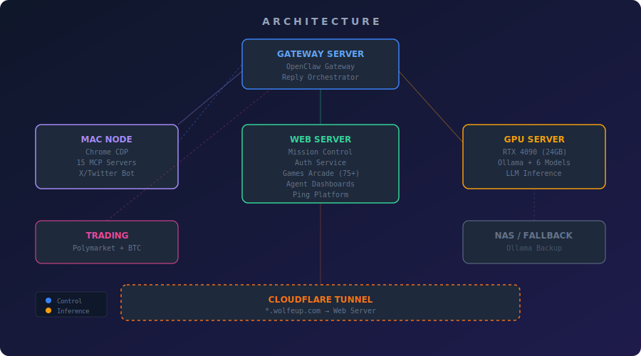

<div align="center">



[](https://mission.wolfeup.com)
[](https://games.wolfeup.com)
[](https://github.com/twolfekc/wolfeup-platform)
[](https://github.com/twolfekc/wolfeup-platform)
[](https://github.com/twolfekc/wolfeup-platform)
[](LICENSE)

</div>

---

## What This Is

A fully self-hosted, autonomous AI infrastructure running 24/7 across 5 machines with zero cloud dependency for compute. Every service is containerized, every LLM call goes to local hardware, and the whole platform manages itself.

**The short version:** an RTX 4090 runs 6 open-source models. A Mac mini controls a Chrome browser via remote debugging. An AI agent browses X (Twitter), scores tweets, writes replies, and posts them — all without a human in the loop. A Mission Control dashboard shows everything happening in real time. 75+ HTML5 games run as Docker containers behind nginx. And this README rewrites itself every few hours.

---

## Architecture



| Server | Role | Key Services |
|--------|------|-------------|
| **Gateway** | AI orchestration hub | OpenClaw gateway, Reply orchestrator, Trends collector |
| **Mac Node** | Browser automation | Chrome CDP, 15 MCP servers, X/Twitter bot |
| **Web Server** | User-facing services | Mission Control, Auth, 75+ game containers, dashboards |
| **RTX 4090** | LLM inference | Ollama, 6 models (Qwen3 32B, Gemma3 27B, etc.) |
| **NAS** | Fallback inference | Ollama backup, storage |

---

## Services

<details>
<summary><strong>Mission Control</strong> — Unified command center</summary>

**Stack:** Next.js 16 · Convex · Tailwind v4 · TypeScript

The nerve center of the entire platform. A dark-themed dashboard that surfaces everything happening across all servers in real time.

**Pages:**
- **Home** — Live system health, GPU VRAM usage, loaded models, orchestrator status
- **Social** — Tweet composer with 6 AI models and 6 tone presets; reply pipeline control
- **Games** — Arcade stats, container health, player counts
- **MCP** — Status of all 15 Model Context Protocol servers
- **Pipeline** — Reply orchestrator job history with full stage-by-stage logs
- **Agents** — OpenClaw agent activity feed
- **Trends** — Trending topics collector dashboard

**Source:** [`services/mission-control/`](services/mission-control/)

</details>

<details>
<summary><strong>Reply Orchestrator</strong> — Autonomous X/Twitter reply bot</summary>

**Stack:** Node.js · Express · Playwright · Ollama

A 9-stage pipeline that runs autonomously on the gateway server:

```
INIT → SEARCH → FILTER → SCORE → SELECT → GENERATE → REFINE → REVIEW → POST
```

1. **SEARCH** — Playwright browses X via Chrome CDP, collects 50–200 candidate tweets
2. **FILTER** — Removes spam, ads, bots, non-English content
3. **SCORE** — `qwen3:30b-a3b` scores each tweet 0–100 for reply potential (MoE, 3B active params = fast)
4. **SELECT** — Picks the highest-scoring tweet
5. **GENERATE** — `qwen3:32b` writes the reply
6. **REFINE** — `gemma3:27b` polishes it (different model family = different voice)
7. **REVIEW** — Safety check, length validation
8. **POST** — Playwright types and submits the reply
9. **VERIFY** — Confirms the post appeared in the article count

**Source:** [`services/reply-orchestrator/`](services/reply-orchestrator/)

</details>

<details>
<summary><strong>Auth Service</strong> — Unified authentication</summary>

**Stack:** Node.js · Express · JWT · Passkey (WebAuthn) · Google OAuth · Apple Sign In

Single auth service protecting all `.wolfeup.com` subdomains via a shared JWT cookie. Supports:
- **Passkey** (WebAuthn, biometric — primary method)
- **Google OAuth**
- **Apple Sign In**
- **Admin panel** with IP-locked access

**Source:** [`services/auth-service/`](services/auth-service/)

</details>

<details>
<summary><strong>MCP Servers</strong> — 15 Model Context Protocol endpoints</summary>

**Stack:** Node.js · mcp-proxy · Playwright · Puppeteer

15 MCP servers running on the Mac Node, each on its own SSE endpoint (ports 9001–9015):

| Port | Server | Purpose |
|------|--------|---------|
| 9001 | Filesystem | Read/write Mac filesystem |
| 9002 | Memory | Persistent key-value store |
| 9003 | Sequential Thinking | Step-by-step reasoning |
| 9004 | Brave Search | Web search |
| 9005 | GitHub | Repos, issues, PRs |
| 9006 | Playwright | Browser automation via Chrome CDP |
| 9007 | Puppeteer | Headless browser |
| 9008 | Desktop Commander | Terminal + file ops |
| 9009 | Xcode Build | iOS/macOS builds |
| 9010 | iOS Simulator | UI control, screenshots |
| 9011 | Shell Commands | Run arbitrary shell commands |
| 9012 | Obsidian | Vault notes |
| 9013 | Context7 | Library docs |
| 9014 | Google Drive | File access |
| 9015 | Everything | Protocol test server |

**Source:** [`automation/mcp-servers/`](automation/mcp-servers/)

</details>

<details>
<summary><strong>Ping Platform</strong> — DNS latency monitoring</summary>

**Stack:** Node.js · Express · WebSocket

Real-time DNS resolution latency tracking across multiple nameservers. Displays geographic latency heatmaps and historical trends.

**Source:** [`services/ping-platform/`](services/ping-platform/)

</details>

<details>
<summary><strong>Polymarket Bot</strong> — Prediction market trading</summary>

**Stack:** Node.js · LLM ensemble · SQLite

Autonomous prediction market trading system using multi-model sentiment analysis:
- **Collectors** — Fear/Greed index, price feeds, news scraping, odds collection
- **Engine** — LLM-based market analysis, bet sizing, self-improvement loop
- **Dashboard** — Real-time P&L, open positions, model confidence scores

**Source:** [`trading/polymarket/`](trading/polymarket/)

</details>

<details>
<summary><strong>BTC Prediction Market</strong> — Bitcoin-specific forecasting</summary>

Real-time Bitcoin price prediction dashboard with multi-timeframe analysis and LLM-generated market commentary.

**Source:** [`trading/btc-prediction-market/`](trading/btc-prediction-market/)

</details>

<details>
<summary><strong>Games Arcade</strong> — 75+ browser games</summary>

75+ HTML5 games running as individual Docker containers. Arcade classics, neon-series originals, card games, puzzle games — each a self-contained static app served through nginx.

**See:** [`games/README.md`](games/README.md)

</details>

---

## Tech Stack

<div align="center">


</div>

**LLM Models (RTX 4090, local):**
- `qwen3:32b` — Primary generation (20.2GB, best benchmarks)
- `qwen3:30b-a3b` — Fast scoring via MoE (18.6GB, only 3B params active)
- `gemma3:27b` — Editorial refinement (17.4GB, Google model family)
- `qwen2.5:32b` — Fallback generation (19.9GB)
- `glm-4.7-flash` — Alternative (19.0GB)
- `nemotron-3-nano` — Alternative (24.3GB)

---

## Getting Started

Each service has its own `Dockerfile` and can be run independently. Copy `.env.example` to `.env` and fill in your values.

```bash
# Clone
git clone https://github.com/twolfekc/wolfeup-platform.git
cd wolfeup-platform

# Configure
cp .env.example .env

# Run a specific service
cd services/mission-control
docker build -t mission-control .
docker run -p 5070:5070 --env-file ../../.env mission-control

# Run reply orchestrator
cd services/reply-orchestrator
npm install
CDP_URL=http://localhost:9222 OLLAMA_RTX4090=http://localhost:11434 node server.js

# Start all 15 MCP servers (Mac only, adjust paths)
cd automation/mcp-servers
BRAVE_API_KEY=... GITHUB_TOKEN=... ./start-all.sh
```

**Requirements:**
- Ollama running with at least one model loaded
- Chrome/Chromium with `--remote-debugging-port` for browser automation
- Docker for containerized services

---

## Living README

> This README is a living document. The `What This Is` section and service descriptions are regenerated every 2–3 hours by `gemma3:27b` running on the RTX 4090, pulling live stats from across the platform before rewriting.
>
> The generator lives in [`automation/readme-generator/`](automation/readme-generator/).

---

<div align="center">

Made in Kansas City · Built on local hardware · Zero cloud compute

[@WolfeUpHQ](https://x.com/WolfeUpHQ)

</div>
